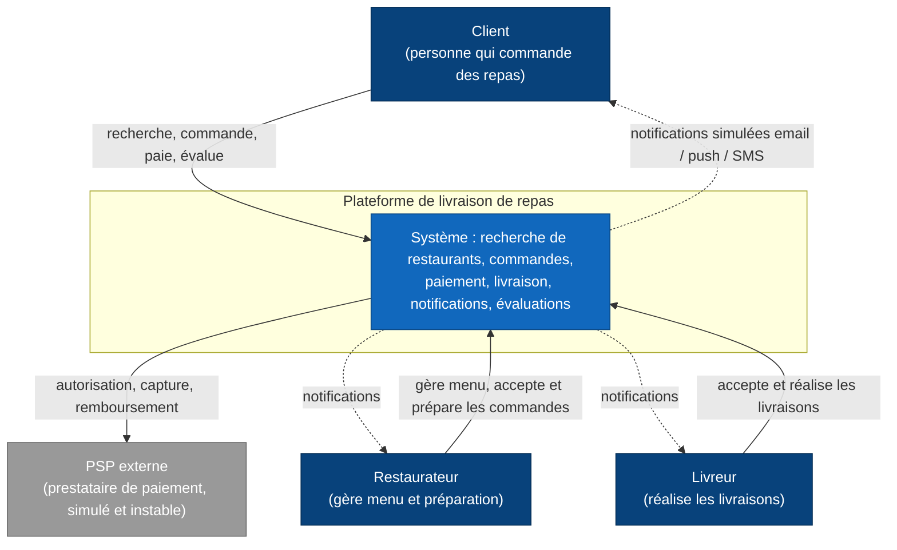
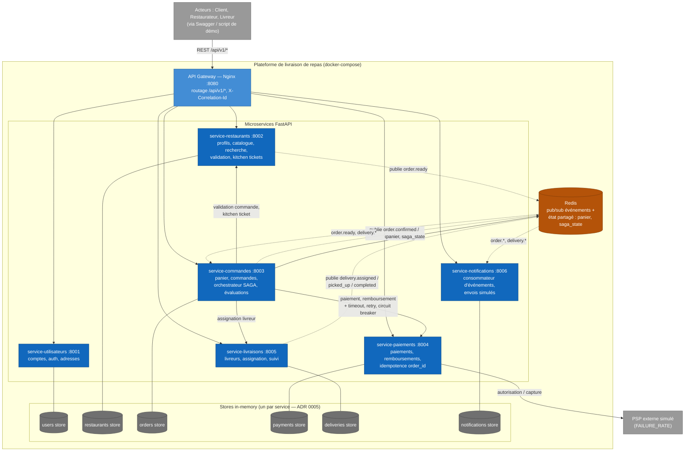

# Architecture — Plateforme de livraison de repas

Vue d'ensemble de l'application en architecture microservices.
Ce document est maintenu par l'agent **documentaliste** et doit refléter l'état réel des services.

## 1. Description générale

La plateforme met en relation trois types d'acteurs : des **clients** qui commandent des repas, des **restaurateurs** qui gèrent leur établissement, leur menu et la préparation des commandes, et des **livreurs** qui assurent la livraison. Le parcours nominal : le client recherche un restaurant, compose son panier, passe commande ; la commande est validée par le restaurant, payée auprès d'un PSP externe (simulé), préparée, puis assignée au livreur disponible le plus proche ; chaque acteur est notifié aux étapes clés ; après livraison, le client peut évaluer le restaurant et le livreur.

Le système est découpé en **6 microservices + 1 API Gateway** ([ADR 0002](decisions/0002-decoupage-services-plateforme-livraison.md)), conformément à la stratégie de **découpe par charge** ([ADR 0001](decisions/0001-strategie-decoupe-microservices-par-charge.md)). Il intègre un **frontend React / TypeScript** ([ADR 0009](decisions/0009-integration-frontend-react-typescript.md)) comprenant une **Vue Testeur (Tester Dashboard)**, ainsi que des démonstrations via Swagger et l'API Gateway Nginx.

## 2. Analyse du domaine (bounded contexts)

L'analyse DDD dégage neuf bounded contexts : **identité & comptes**, **restaurants**, **catalogue** (menus/plats/prix), **commandes & checkout**, **paiement**, **livraisons**, **livreurs**, **notifications**, **évaluations**. Trois d'entre eux sont **fusionnés** dans un service voisin pour le prototype, avec des déclencheurs d'extraction documentés (ADR 0002) :

- **catalogue → service-restaurants** (extraction future : catalogue-service en lecture seule alimenté par événements, si le trafic de recherche diverge) ;
- **évaluations → service-commandes** (faible volume, liées au cycle de vie de la commande) ;
- **livreurs → service-livraisons** (extraction future : courier-service, si tracking GPS temps réel).

## 3. Inventaire des services

| Service | Bounded context(s) | Responsabilités | Modèle de données (agrégats) | Port |
|---|---|---|---|---|
| **gateway** (Nginx) | edge | Point d'entrée unique, routage `/api/v1/<domaine>/*`, propagation `X-Correlation-Id` ; futur : auth centralisée, rate limiting, TLS | Aucun (stateless) | 8080 |
| **service-utilisateurs** (`users`) | Identité & comptes | Inscription, login (token opaque), profil, adresses, **rôle** (`client`/`restaurant_owner`/`courier`) — source de vérité du RBAC ([ADR 0010](decisions/0010-controle-acces-par-role-rbac.md)) | `User` (avec `role`), `Address` | 8001 |
| **service-restaurants** (`restaurants`) | Restaurants + catalogue | Profil, horaires, menus (plats/prix/options), **recherche** (localisation/cuisine/plat), validation de commande, kitchen tickets (acceptation/refus), préparation `ACCEPTED→PREPARING→READY` | `Restaurant`, `MenuItem`, `KitchenTicket` | 8002 |
| **service-commandes** (`orders`) | Commandes & checkout + évaluations | Panier (Redis), passage de commande, calcul du prix (sous-total + livraison), machine à états `RECEIVED→PREPARING→DELIVERING→DELIVERED / CANCELLED`, **orchestrateur SAGA**, historique, évaluations | `Cart` (Redis), `Order` (avec snapshot des prix, `saga_state`), `Evaluation` | 8003 |
| **service-paiements** (`payments`) | Paiement | Autorisation/capture via PSP externe simulé (mode instable `FAILURE_RATE`), remboursements partiels/totaux, **idempotence par `order_id`** | `Payment` (statuts `AUTHORIZED`, `CAPTURED`, `FAILED`, `REFUNDED`, `PARTIALLY_REFUNDED`, remboursements) | 8004 |
| **service-livraisons** (`deliveries`) | Livraisons + livreurs | Profils livreurs, disponibilité, localisation simulée, assignation du plus proche, cycle `PROPOSED→ACCEPTED→PICKED_UP→DELIVERED`, publication d'événements | `Courier`, `Delivery` | 8005 |
| **service-notifications** (`notifications`) | Notifications | Consommation des événements Redis, envoi simulé email/push/SMS (structlog), consultation `GET /api/v1/notifications` | `Notification` | 8006 |

> Ports d'exposition en développement local ; en Docker, chaque service écoute 8000 en interne et seul le gateway (8080) est le point d'entrée nominal.

## 4. Principes directeurs

- **Découpe par charge** (ADR 0001) : un composant fortement sollicité ou critique est isolé (restaurants pour la lecture, paiements pour la criticité) ; en cas de doute, fusion documentée avec déclencheur d'extraction (ADR 0002).
- **Stateless** : aucun état de session en mémoire locale destinée à être partagée ; panier et `saga_state` dans **Redis**. (Limite prototype : les stores in-memory contraignent à une instance par service tant que la persistance réelle n'est pas en place — ADR 0005.)
- **Santé** : chaque service expose **`/health`** à la racine (hors préfixe API) pour les health checks compose/load balancer.
- **Pas de partage de code métier** entre services ; communication uniquement par le réseau.
- **Versionnement d'API** : toutes les routes métier sont préfixées **`/api/v1`** — les évolutions incompatibles passeront par `/api/v2` sans casser les clients existants.
- **Contrôle d'accès par rôle (RBAC)** : le champ `role` du service `users` est la **source de vérité** ([ADR 0010](decisions/0010-controle-acces-par-role-rbac.md)). Le cloisonnement des vues (garde `RequireRole`, navigation, redirections) est appliqué **côté frontend** ; le durcissement de l'autorisation côté API / gateway reste à généraliser.
- **Traçabilité** : logs structurés (structlog JSON) + `X-Correlation-Id` généré si absent et propagé à chaque appel sortant et dans chaque événement.

## 5. Diagramme de contexte (C4 — niveau 1)

*Légende : rectangles bleu foncé = acteurs ; bleu = système documenté ; gris = système externe. Flèches pleines = interactions requête/réponse ; pointillées = flux sortants sans réponse attendue.*

## 6. Diagramme de conteneurs (C4 — niveau 2)

*Légende : flèches pleines = appels **synchrones** REST (httpx) ; flèches pointillées = **asynchrone** (publication/consommation d'événements Redis pub/sub) ; traits sans flèche = accès à un store de données. Chaque service possède son store exclusif.*

## 7. Communication inter-services

| Interaction | Mode | Justification |
|---|---|---|
| Client → gateway → services | REST sync | Requête/réponse classique |
| orders → restaurants : validation de commande | REST sync (httpx) | La saga attend la réponse avant de payer |
| orders → payments : paiement, remboursement | REST sync | Étape bloquante ; **circuit breaker + retry + timeout** ici ([ADR 0007](decisions/0007-resilience-circuit-breaker-maison.md)) |
| orders → restaurants : acceptation (kitchen ticket) | REST sync | Réponse accepter/refuser requise |
| orders → deliveries : assignation d'un livreur | REST sync | Il faut savoir immédiatement si un livreur est trouvé |
| `order.confirmed`, `order.cancelled`, `order.delivered` | Async Redis pub/sub | Plusieurs consommateurs, aucune réponse attendue |
| `order.ready` (publié par restaurants) | Async | orders s'y abonne et déclenche l'assignation |
| `delivery.assigned` / `picked_up` / `completed` | Async | Suivi : orders met à jour l'état, notifications alerte. `delivery.assigned` / `picked_up` portent `user_id` (propagé par orders → deliveries) pour router la notif client ; omis de `completed` car couvert par `order.delivered` ([ADR 0011](decisions/0011-propagation-user-id-notifications-livraison.md)) |
| `evaluation.created` | Async | Note moyenne côté restaurants — cohérence éventuelle |

Format d'événement : `{"event": str, "correlation_id": str, "data": {...}}` sur les canaux `order.*`, `delivery.*`, `evaluation.*`. Le broker est abstrait derrière une interface `EventBus` (`RedisEventBus` prod / `InMemoryEventBus` tests) — choix et limites dans l'[ADR 0004](decisions/0004-redis-pubsub-broker-evenements.md).

## 8. Gestion des données

- **Une base (store) par service**, aucune donnée partagée : chaque service est seul propriétaire de ses agrégats et les autres n'y accèdent que par son API ou ses événements.
- **Prototype** : stores **in-memory derrière des interfaces repository** (ADR 0005) — la migration vers PostgreSQL/SQLAlchemy se fera implémentation par implémentation sans toucher au code métier.
- **Snapshot des prix** : `Order.items` copie nom et prix unitaire au moment de la commande ; un changement de menu ultérieur n'affecte pas les commandes passées (découplage commandes/catalogue).
- **Cohérence éventuelle** assumée pour tout ce qui transite par événements (notes moyennes, notifications, statuts de suivi) ; la cohérence forte est réservée à la phase orchestrée de la saga.
- État réellement partagé ou devant survivre à une requête (panier, `saga_state`) : **Redis**.

## 9. API Gateway

Le gateway **Nginx** ([ADR 0006](decisions/0006-api-gateway-nginx.md)), exposé sur **8080**, est l'unique point d'entrée nominal :

- routage par préfixe : `/api/v1/users/*`, `/api/v1/restaurants/*`, `/api/v1/orders/*`, `/api/v1/payments/*`, `/api/v1/deliveries/*`, `/api/v1/notifications/*` ;
- propagation de `X-Correlation-Id` ;
- responsabilités futures documentées : authentification centralisée, rate limiting, TLS, load balancing de N instances par service.

> **Limite connue — résolution DNS statique** : les directives `proxy_pass` visent les upstreams par **nom de service** et Nginx **résout leur IP au démarrage**. Après un `docker compose up -d` qui **recrée** un conteneur backend (nouvelle IP), le gateway garde l'IP périmée → **404 / 502 trompeurs**. Contournement actuel : `docker compose restart gateway`. Amélioration envisagée : `resolver` Nginx + variables pour une résolution dynamique (voir [problème 2026-07-23](problemes/2026-07-23-config-inter-services-docker-compose-prefixes.md)).

## 10. Résilience (résumé)

Détail dans l'[ADR 0007](decisions/0007-resilience-circuit-breaker-maison.md). Module `resilience.py` interne au service-commandes, appliqué aux appels sortants de l'orchestrateur (cible principale : **orders → payments**, dont le PSP simulé est instable) :

1. **Timeout** 2,0 s sur chaque appel sortant ;
2. **Retry** ×3 avec backoff exponentiel + jitter — uniquement sur timeout/5xx/erreur réseau, jamais sur 4xx ; sûr grâce à l'**idempotence par `order_id`** côté paiements ;
3. **Circuit breaker** `CLOSED→OPEN→HALF_OPEN` : ouverture à 5 échecs sur 30 s, essai de refermeture après 15 s ; circuit ouvert = échec rapide → compensation immédiate de la saga.

## 11. SAGA de passage de commande (résumé)

Détail dans l'[ADR 0003](decisions/0003-saga-orchestree-passage-commande.md). Approche **hybride** : la phase critique (validation restaurant → paiement → acceptation cuisine) est **orchestrée** par le service-commandes en appels synchrones avec **compensations explicites** (annulation, remboursement total si le paiement avait été capturé) ; l'aval (préparation prête, assignation, suivi de livraison, notifications) est **chorégraphié** par événements. L'avancement de chaque saga est tracé dans `Order.saga_state` (Redis).

## 12. Stack et infrastructure

- **Backend** : Python 3.13, FastAPI, Pydantic v2, httpx (inter-services async), Redis, structlog. Tests : pytest (couverture ≥ 80 %), ruff, mypy.
- **Infra** : Docker + docker-compose (6 services + gateway + Redis, healthchecks) ; Makefile (`run`, `test`, `lint`, `build`).
- **Pas de frontend** dans le prototype (ADR 0008) : démonstration via Swagger `/docs`, gateway et script de scénario.

## 13. Conventions inter-services

- Contrats d'API : OpenAPI généré par FastAPI, exposé sur `/docs` de chaque service.
- Erreurs normalisées (code, message, détails) — jamais d'erreur brute exposée au client final.
- `X-Correlation-Id` : généré s'il est absent, propagé aux appels sortants et inclus dans les événements et les logs structlog.
- Testabilité hermétique : aucun test n'exige un Redis ou un service tiers actif (repositories in-memory, `InMemoryEventBus`, client HTTP mocké).

### Configuration inter-services (env_prefix)

- Chaque service lit sa configuration via **pydantic-settings** avec un **`env_prefix` propre** : `ORDERS_`, `RESTAURANTS_`, `DELIVERIES_`, `NOTIFICATIONS_`, `USERS_`. Toute variable injectée par `docker-compose.yml` **doit être préfixée** en conséquence, sinon elle est **silencieusement ignorée** et le service retombe sur ses valeurs par défaut (`localhost`). Exemples : `ORDERS_RESTAURANTS_URL=http://restaurants:8000`, `<PREFIX>_REDIS_URL=redis://redis:6379/0`.
- En Docker, les URLs inter-services pointent sur le **nom de service** et le **port interne 8000** (jamais `localhost`).
- **Activation du bus Redis** : le nom du champ diffère encore selon les services — `ORDERS_EVENT_BUS_BACKEND=redis` (orders), `RESTAURANTS_EVENT_BUS=redis` (restaurants), `DELIVERIES_EVENT_BACKEND` / `NOTIFICATIONS_EVENT_BACKEND=redis` (deliveries, notifications). Hétérogénéité à harmoniser (dette ouverte).
- **Statut HTTP vs état métier** : la saga de commande renvoie **HTTP 201 même pour une commande annulée** ; les clients (frontend inclus) doivent se baser sur `order.status` et non sur le seul code HTTP.
