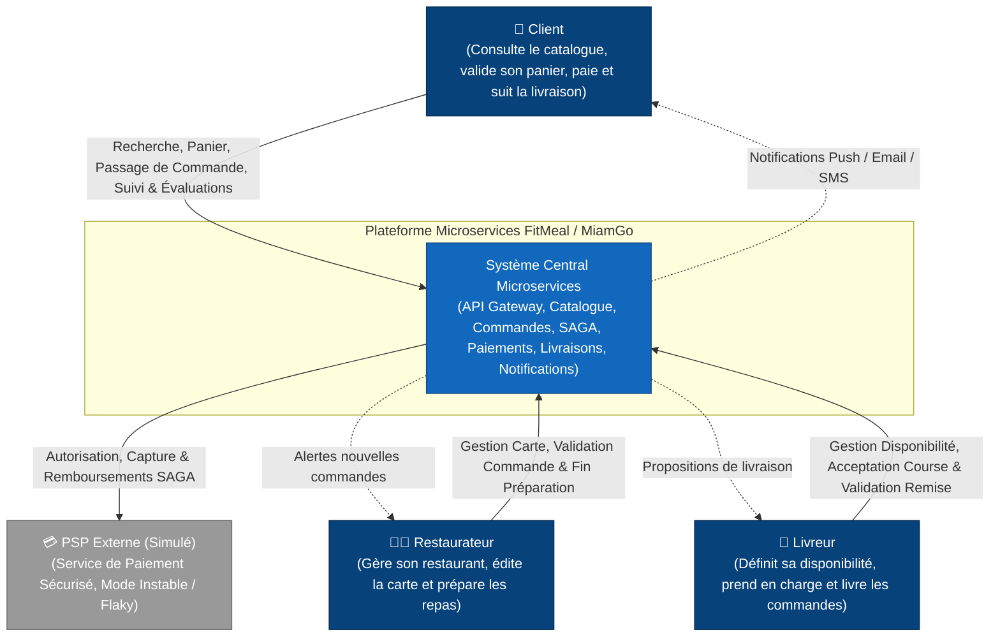
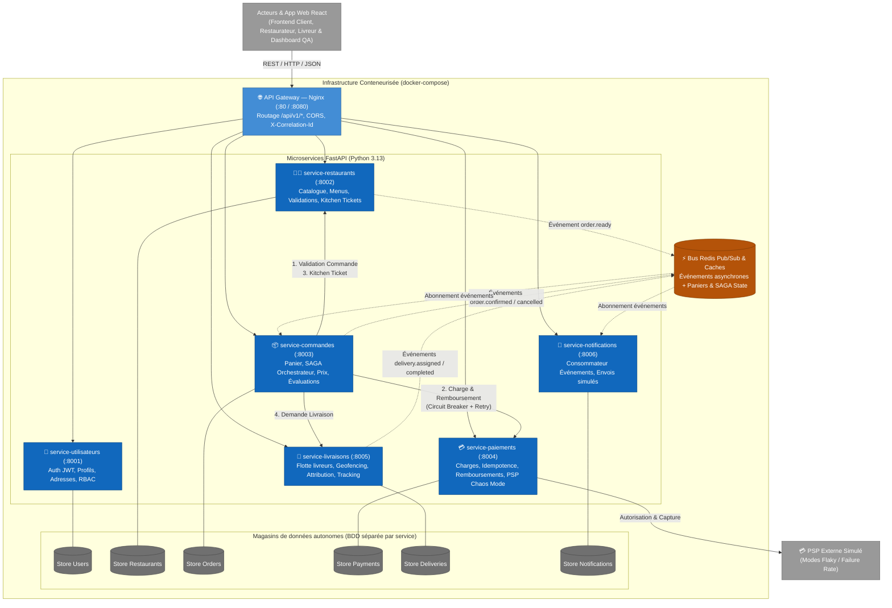
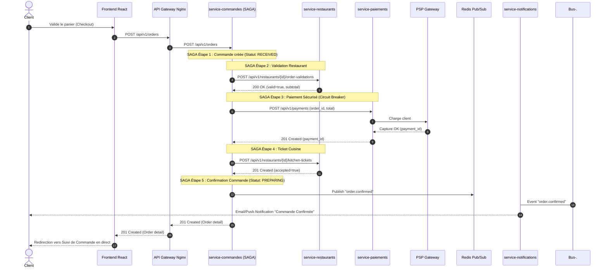
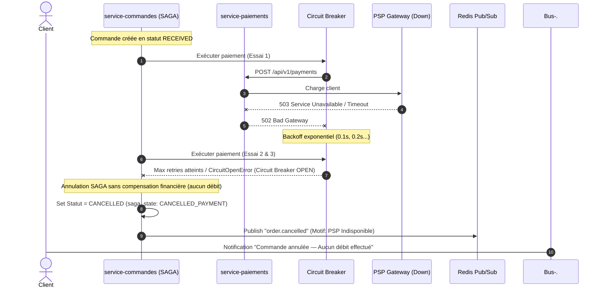
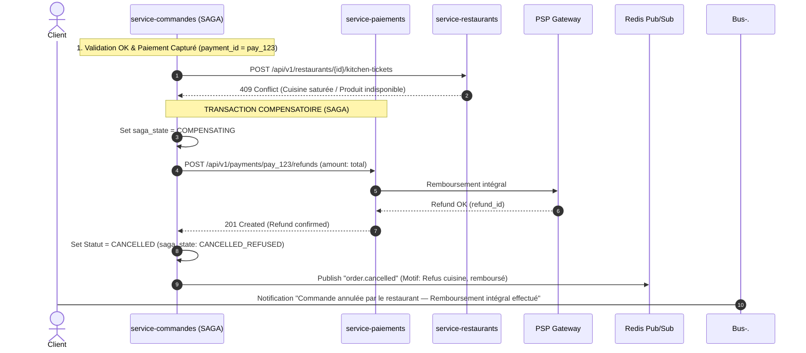
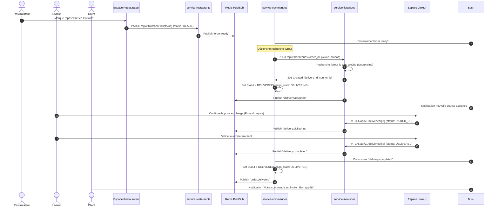
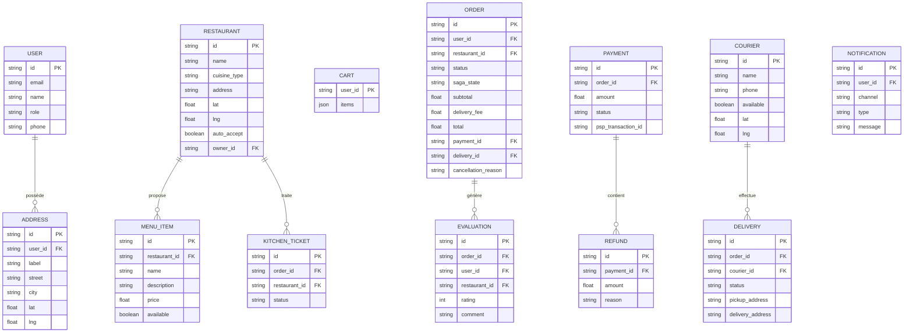

# 📐 LIVRABLE 2 : DIAGRAMMES D'ARCHITECTURE & DE SÉQUENCE — FITMEAL / MIAMGO

---

## 1. Diagramme de Contexte Système (C4 — Niveau 1)

Ce diagramme présente la plateforme dans son environnement global avec ses trois profils d'utilisateurs et le PSP externe.

---

## 2. Diagramme de Conteneurs (C4 — Niveau 2)

Détail de l'infrastructure conteneurisée (`docker-compose`) avec les 6 microservices, la Gateway Nginx, Redis et les magasins de données isolés.

---

## 3. Diagramme de Séquence 1 : SAGA Passage de Commande Nominale

---

## 4. Diagramme de Séquence 2 : Résilience & Circuit Breaker (Échec PSP)

---

## 5. Diagramme de Séquence 3 : SAGA Compensation (Refus Cuisine après Paiement)

---

## 6. Diagramme de Séquence 4 : Flux de Livraison (Chorégraphie Événementielle)

---

## 7. Diagramme Modèle de Données & Agrégats (ERD)

